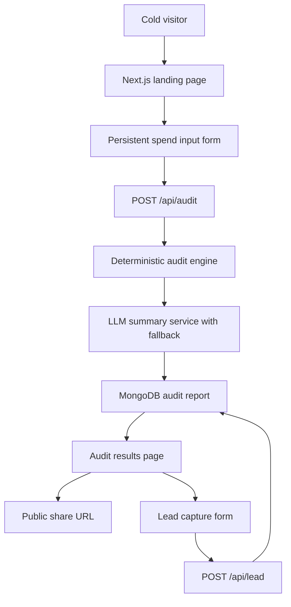

# Architecture

## System Diagram

## Data Flow

1. A visitor opens the landing page and enters tools, plans, seats, spend, team size, and use case.
2. Form state persists locally in Zustand so the audit can survive refreshes.
3. The frontend submits the payload to the backend audit endpoint.
4. The backend runs deterministic pricing and savings rules, then asks the configured LLM for a short summary.
5. If the LLM fails, the backend falls back to a templated summary so the result still ships instantly.
6. The full audit report is stored in MongoDB.
7. The frontend loads the report by slug and renders both the private results view and public share-safe version.

## Why This Stack

- Next.js: fast path to a polished public landing page plus shareable result routes.
- TypeScript: useful here because the audit payload and report output need to stay consistent across frontend and backend.
- Express: thin enough for a small MVP, but structured enough to keep controllers, services, validators, and middleware separate.
- MongoDB: a natural fit for storing nested audit documents and optional lead details in one place.

## If This Had To Handle 10k Audits Per Day

- Cache tool pricing metadata centrally instead of bundling it only in code.
- Move audit creation and summary generation into a queue so LLM latency never blocks the request path.
- Add analytics events and a proper job worker for lead emails and follow-up workflows.
- Introduce structured observability, request tracing, and usage dashboards.
- Add stronger anti-abuse controls and per-IP plus per-email throttling.
